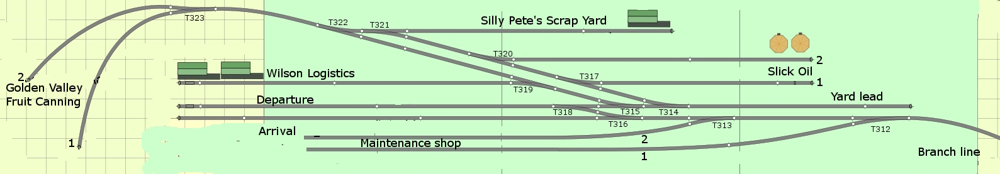

# rasp_routes_py
This Python program, **`rasp_routes_py`**, allows you to set routes on your model railroad layout using a Raspberry Pi.

# History
For my model railroad I was looking for a way to be able to set routes thru series of turnouts by pressing one button on either end of the desired route. Eventually the rasp_routes program, written in C, came out of these efforts. See the rasp_routes repository. But I couldn't find a suitable C library to work with the Adafruit 16 channel servo HAT. I found one in python, so I rewrote the program logic in python.

At this moment (september 12, 2015) it's a work in progress.

# Configuration file
The program is driven by a configuration file. This file knows the following types of lines:

## Line types

#### Comment or empty lines
Do nothing, just for documentation purposes. Comment lines start with '#'
	
#### Name of Layout line
This line - there's typically only one of these - defines the name of the Layout. This name is used in the welcome and closing messages. The input lines have the following syntax (individual fields are described further down):

**`name:[layout_name]`**

#### Input definition lines
These define the GPIO lines that must function as inputs. The input lines have the following syntax:

**`input:[id_number]:[gpio_number]:[descriptive_text]`**

#### Turnout definition lines
These define the addresses that must function as outputs. The output lines have the syntax as described below:

**`turnout:[id_number]:[board]:[channel]:[posclos]:[posthro]:[turnout_name]`**

#### Route definition lines
These define the valid routes in terms of combinations of buttons and desired positions of the turnouts. The route definition lines have the following syntax:

**`route:[id-number]:[route_definition]:[turnout_states]`**

### Field descriptions
The various fields are described below.

**`layout_name`** - This text defines the name of the Layout.

**`name`**, **`input`**, **`turnout`**, **`route`** - These are literals defining the line type. Actually, only their first letters are checked (n, i, t and r). These are case-independant.

**`id_number`** - Is a documentary number that is not actually used within the program. As all types are stored in lists inside the program, starting with zero and numbering up by one, up to the number of lines for input or output you specify. It is therefore convenient and a good habit of using them, starting with '00', counting up by +1 at a time.  These documentary numbers are convenient for the definition of valid routes, see below.

**`gpio_number`** - This is the number of the GPIO port that will be used for input.

Mind you: These are NOT the pin numbers on the 40 pin header, they are the actual GPIO numbers as defined by Broadcom, for example: header pin 40 on the RPi connects to GPIO number 21. It is this last number, 21, that you would code here. Check the bcm2835 documentation for the relation between GPIO's and pin numbers.

All input GPIO's will be inilialized as **`pull_up_down=GPIO.PUD_UP`**, meaning that they have to be pulled down to GND to activate.

**`descriptive_text`** - This text is used to descibe the input buttons. In my original use case these contain spur names.

**`board`** - identification of the servo HAT board the servo is connected to. These numbers are specified in the documentation as hexadecimal numbers (i.e. 0x40). For ease of parsing this program expects decimal numbers, so 0x40 will be specified as 64 here.

**`channel`** - the slot number for the servo (range 0-15) on the **`[board]`** given in the same line.

**`posclos`** - the desired position for this turnout when in the closed position (broadly in the range 210-400).

**`posthro`** - the desired position for this turnout when in the thrown position (broadly in the range 210-400).

**`turnout_name`** - This text describes the names of your turnouts.

**`route_definition`** - A route definition specifies two inputs that define a route as start- and end-point. Routes are specified by two input id_numbers. When for 	example we want a route from inputs 4 and 8, we specify "0408". 	Note that the route from 8 to 4 is identical (duh). Whlie running, the 	program evaluates pushed buttons in numerical order, so when one 	activates inputs 8 and 4 in that order, the program will evaluate that 	against a route identified by "0408".

**`turnout_states`** - This field is stored in a table next to the valid routes table. It contains 1 character per turnout, so the length of this field must be equal to the 	number of specified turnouts. 	Values for each character in this field are:

* **`t`** :: indicate that when the route is selected, this turnout must be set to thrown, the corresponding output GPIO will be set to HIGH

* **`c`** :: indicate that when the route is selected, this turnout must be set to closed, the corresponding output GPIO will be set to LOW

* **`-`** :: the hyphen indicaties that this turnout is to be left alone, nothing happens to that GPIO, it is left in the state it had.

## Example
In the rasp_routes.ini file you will find an example, based on my ***Washtown Industries*** yard. It's layout and relevant characteristics are enclosed as file '*Washtown_Industries.jpg*'. 

When you have a look in the rasp_routes.ini file, there is a route specified as:

**`route:03:1216:cctt--------`**

Now suppose we want to set a route from the "Branchline" to "Team track 2 - Departure". We would then activate inputs 12 and 16 (or: GPIO's 16 and 20), activating route ("1216"). This would mean that turnouts 0 and 1 (or: T400 and T401, see the turnout section) have to be set to Closed and that turnouts 2 and 3 (or: T402 and T403) have to be set to Thrown. (picture does not represent the proper turnout names yet).

## License / availability
This software is available under the conditions of the GNU General Public License. See the LICENSE file for further details.
