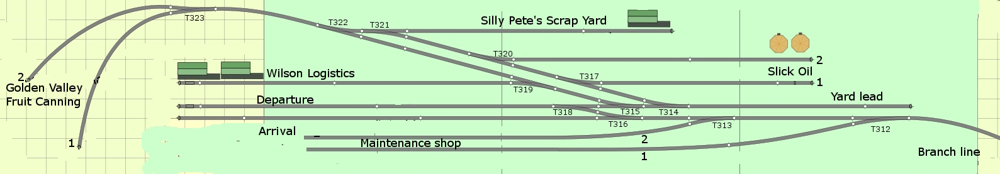

# Configuration file
The program is driven by a configuration file. This file knows the following types of lines:

## Line types

#### Comment or empty lines
Do nothing, just for documentation purposes. Comment lines start with '#'
	
#### Name of Layout line
This line - there's typically only one of these - defines the name of the Layout. This name is used in the welcome and closing messages. The input lines have the following syntax (individual fields are described further down):

**`name:[layout_name]`**

#### Input definition lines
These define the GPIO lines that must function as inputs. The input lines have the following syntax:

**`input:[gpio_number]:[descriptive_text]`**

#### Turnout definition lines
These define the addresses that must function as outputs. The output lines have the syntax as described below:

**`turnout:[type]:[board]:[channel]:[posclos]:[posthro]:[turnout_name]`**

#### Route definition lines
These define valid routes in terms of combinations of buttons and desired positions of the turnouts. The route definition lines have the following syntax:

**`route:[input1]:[input2]:[turnout_states]`**

### Field descriptions
The various fields are described below.

**`layout_name`** - This text defines the name of the Layout.

**`name`**, **`input`**, **`turnout`**, **`route`** - These are literals defining the line type. Actually, only their first letters are checked (n, i, t and r). These are case-independant.

**`gpio_number`** - This is the number of the GPIO port that will be used for input.

Mind you: These are NOT the pin numbers on the 40 pin header, they are the actual GPIO numbers as defined by Broadcom, for example: header pin 40 on the RPi connects to GPIO number 21. It is this last number, 21, that you would code here. Check the bcm2835 documentation for the relation between GPIO's and pin numbers.

All input GPIO's will be inilialized as **`pull_up_down=GPIO.PUD_UP`**, meaning that they have to be pulled down to GND to activate.

**`descriptive_text`** - This text is used to descibe the input buttons. In my original use case these contain spur names.

**`type`** - the type of turnout control, possible values:

* **`servo`** :: the turnout is operated by a servo

* **`relay`** :: the turnout is operated through a relay
 
**`board`** - identification of the servo HAT board the servo or relay is connected to. These numbers are specified in the documentation as hexadecimal numbers (i.e. 0x20 or 0x40). For ease of parsing this program expects decimal numbers, so 0x40 will be specified as 64 here.

**`channel`** - the slot number for the servo or relay (range 0-15) on the **`[board]`** given in the same line.

**`posclos`** - the desired position for this turnout when in the closed position (broadly in the range 210-400 for servo's, and 0 or 1 for relays).

**`posthro`** - the desired position for this turnout when in the thrown position (broadly in the range 210-400 for servo's, and 0 or 1 for relays).

**`turnout_name`** - This text describes the names of your turnouts.

**`input1`** **`input2`** - A route is defined by two inputs, one as start- and one as end-point. Routes are specified by two input gpio_numbers. When for example we want a route from input 16 to input 18, we specify "16:18". Note that the route from 18 to 16 is identical (duh). While running, the program evaluates activated inputs in numerical order, so when one activates inputs 18 and 16 in that order, the program will evaluate that against a route identified by "16:18".

**`turnout_states`** - This field is stored in a table parallel to the "valid routes" table. It contains 1 character per turnout, so the length of this field must be equal to the number of specified turnouts. The order of these positions corresponds to the order in which the turnout-lines are specified. The meaning of the values for each character in this field are:

* **`t`** :: indicate that when the route is selected, this turnout must be set to thrown, the corresponding servo will be set to its defined thrown position, or the output GPIO will be set to HIGH

* **`c`** :: indicate that when the route is selected, this turnout must be set to closed, the corresponding servo will be set to its defined closed position, or the output GPIO will be set to LOW

* **`-`** :: the hyphen indicaties that this turnout is to be left alone, nothing happens to that turnout, it is left in the state it had.

## Example
In the rasp_routes_py.ini file you will find an example, based on my ***Washtown Industries*** yard. It's layout and relevant characteristics are enclosed as file '*Washtown_Industries.jpg*'. 

When you have a look in the rasp_routes_py.ini file, there is a route specified as:

**`route:12:16:cctt--------`**

Now suppose we want to set a route from the "Branchline" to "Team track 2 - Departure". We would then activate inputs 16 and 20, activating route ("12:16"). This would mean that the first and second specified turnouts (T400 and T401, see the turnout section) have to be set to Closed and that the third and fourth specified turnouts (T402 and T403) have to be set to Thrown. (picture does not represent the proper turnout names yet).

## See also:
[Readme file](../README.md)

[Explanation of the configuration file](../doc/CONFIG.md)

[Installation HOW TO file](../doc/INSTALL.md)

[Calibrating your servo's](../doc/gawServoCalibrate.md)

[Roadmap or TODO file](../doc/TODO.md)

[License file](../LICENSE)
